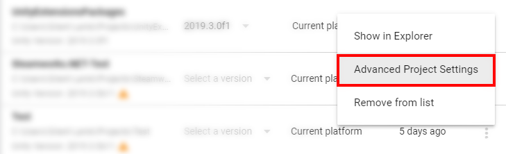
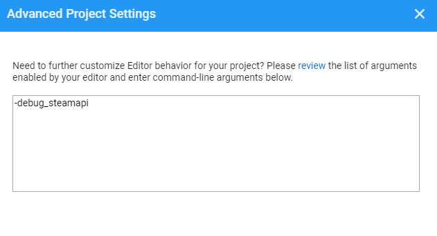

# UnityExtensionsSteamworks
A C# Wrapper for Valve's Steamworks API. This is a package version for Unity, source code & documentation here: https://github.com/rlabrecque/Steamworks.NET.

## Notes & Tips
- This version supports IL2CPP on Windows x64 (more than 99% in Steam users), so if you enabled IL2CPP you have to make sure to set your build settings to x86_64 in Unity.
- I add a SteamworksHelper script to simplify programming, you can use `Callback` like this:
```
        CallbackEvent<GameOverlayActivated_t>.AddListener(
            r => Debug.Log($"gameOverlayActivated: {r.m_bActive}"));
```

- Use `CallResult` like this:
```
        if (!CallResultEvent<NumberOfCurrentPlayers_t>.TryMonitor(
            SteamUserStats.GetNumberOfCurrentPlayers(),
            (r, f) => Debug.Log($"numberOfCurrentPlayers: {r.m_cPlayers}")))
        {
            // to do: if GetNumberOfCurrentPlayers returns the invalid handle
        }
```
- You can debug SteamAPIs by calling `SteamClient.SetWarningMessageHook` (If you use `SteamworksHelper.Init` it's done inside). To make this work you have to add command-line argument `-debug_steamapi`: click project options button (the icon is 3 dots) on Unity Hub, select "Advanced Project Settings", then add `-debug_steamapi` on the popup panel.
<p align="center">
  <br>
</p>
<p align="center">
  <br>
</p>

## Installation
Unity can not install dependent packages automatically at present, you have to install them manually:
- https://github.com/90-games/UnityExtensionsCommon

Open the package manager window (menu: Window > Package Manager), select "Add package from git URL...", fill in this in the pop-up textbox: https://github.com/90-games/UnityExtensionsSteamworks.git.


## Steamworks.NET
_Steamworks.NET_ is a C# Wrapper for Valve's Steamworks API, it can be used either with Unity or your C# based Application.

_Steamworks.NET_ was designed to be as close as possible to the original C++ API, as such the documentation provided from Valve largely covers usage of _Steamworks.NET_.
Niceties and C# Idioms can be easily implemented on top of _Steamworks.NET_.

_Steamworks.NET_ currently fully supports Windows, OSX, and Linux in both 32 and 64bit varieties. Currently building against Steamworks SDK 1.46.

* Author: [Riley Labrecque](https://github.com/rlabrecque)
* License: [MIT](http://www.opensource.org/licenses/mit-license.php)
* [Documentation](https://steamworks.github.io/)
* [Discussion Thread](http://steamcommunity.com/groups/steamworks/discussions/0/666827974770212954/)
* [Reporting Issues](https://github.com/rlabrecque/Steamworks.NET/issues)
* 1-on-1 support is available by donating $100 USD or greater.
 * Support can be obtained via [Email](mailto:support@rileylabrecque.com), [Skype](http://rileylabrecque.com/skype), or [Steam](http://steamcommunity.com/id/rlabrecque)
 * I can only help with Steamworks.NET specific issues, general API questions should be asked on the [Steamworks discussion board](http://steamcommunity.com/groups/steamworks/discussions).

[](https://www.paypal.com/cgi-bin/webscr?cmd=_s-xclick&hosted_button_id=YFZZER8VNXKRC)


[Installation Instructions](http://steamworks.github.io/installation/)
-----

Samples
-----
Check out these sample projects to get started:
* [Steamworks.NET Example](https://github.com/rlabrecque/Steamworks.NET-Example)
* [Steamworks.NET Test](https://github.com/rlabrecque/Steamworks.NET-Test)
* [Steamworks.NET ChatClient](https://github.com/rlabrecque/Steamworks.NET-ChatClient)
* [Steamworks.NET GameServerTest](https://github.com/rlabrecque/Steamworks.NET-GameServerTest)
